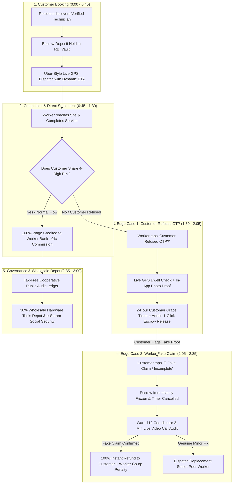

# SAHYOG: 3-Minute SIH Winning Pitch Script, Flow Diagram & Jury Q&A Defense

> **Language**: Hinglish (Roman English Script)  
> **Pitch Duration**: Exactly 180 Seconds (3 Minutes)  
> **Target Audience**: Smart India Hackathon (SIH) Jury & Technical Evaluators

---

## 1. Master System Flow Diagram

---

## 2. Second-by-Second 3-Minute Pitch Script

### [0:00 - 0:30] Hook & Problem Statement
* **Screen**: Home Page / Landing Page
* **Pitch Line**:
  > *"Namaste Judges! India ke 5 crore blue-collar gig workers Urban Company aur commercial apps par 20% se 30% tak ka bhari commission gavate hain, jabki customers ko fake claims aur safety ka darr rehta hai.*  
  > *Hum pesh karte hain **SAHYOG** — Bharat ka pehla 100% Worker-Owned Digital Cooperative Platform, jo India Stack, RBI Escrow, aur Local Ward Governance ko jodkar **₹0 Commission** aur **100% Fraud-Proof Escrow Security** deta hai."*

---

### [0:30 - 1:15] Demo Step 1 & 2: Booking & Real-Time Live GPS
* **Demo Action**: Jury Bar se **Step 1 (Customer Booking)** aur **Step 2 (Live GPS Map)** par tap karein.
* **Pitch Line**:
  > *"Step 1 me customer verified technician (jaise Awadhesh Sharma) ko book karta hai. Paisa kisi private company ke account me nahi, balki RBI-compliant **Cooperative Escrow Vault** me safe hold ho jata hai.*  
  > *Step 2 me real-time Uber-style GPS tracking live ho jaati hai, jisme dynamic ETA, vehicle telemetry aur secret 4-digit completion PIN generated rehta hai."*

---

### [1:15 - 1:45] Demo Step 3: PIN Verification & 100% Direct Payout
* **Demo Action**: Jury Bar se **Step 3 (100% Worker Payout)** par tap karein.
* **Pitch Line**:
  > *"Kaam poora hone par jaise hi customer apna 4-digit PIN share karta hai, pura ₹450 (100% labour wage) bina kisi ₹1 ke commission cut ke seedha worker ke bank account me credit ho jata hai.*  
  > *Worker Dashboard par instant UTR proof aur transparent earnings dikhti hain."*

---

### [1:45 - 2:20] The Game Changer (Edge Case 1): "Agar Customer ne OTP nahi diya?"
* **Demo Action**: Jury Bar se **"OTP Refusal"** button par tap karein.
* **Pitch Line**:
  > *"Ab aate hain real-world edge case par — **Agar customer ne kaam ke baad OTP dene se mana kar diya toh?**  
  > Worker 1-tap me **'Proof-of-Work'** submit karta hai. Hamara system hardware GPS se verify karta hai ki worker 45 minutes on-site tha. In-app live camera se before/after photos attach hoti hain.*  
  > *Customer ko 2-hour auto-release notice jata hai, aur Cooperative Admin 1-click me verified proof dekh kar worker ka 100% payment release kar sakta hai!"*

---

### [2:20 - 2:45] Anti-Fraud Defense (Edge Case 2): "Agar Worker ne Fake Claim daala?"
* **Demo Action**: Jury Bar se **"Video Audit"** button par tap karein.
* **Pitch Line**:
  > *"Lekin agar worker ne fake claim karne ki koshish ki toh? Customer sirf 1 click me **'🚨 Fake Claim / Stop'** dabata hai.*  
  > *Escrow turant freeze ho jata hai aur timer stop ho jata hai. System turant area ke **Ward 112 Coordinator (Rajendra Shukla)** ko assign karta hai.*  
  > *Coordinator customer ke sath **2-minute ka In-App Live Video Call Audit** karke site dekhta hai aur 1-click me **100% Instant Refund** reverse kar deta hai aur fraud worker ki cooperative equity forfeit ho jaati hai!"*

---

### [2:45 - 3:00] Governance, Wholesale Depot & Closing
* **Demo Action**: Jury Bar se **Step 4 (Co-Op Invoice)** par tap karein.
* **Pitch Line**:
  > *"SAHYOG me workers ko 30% wholesale rate par tools milte hain, e-Shram aur DigiLocker se verified credentials milte hain, aur Public Democratic Audit Ledger se 100% transparency banti hai.*  
  > *Yeh sirf ek app nahi, Bharat ke shramikon ka apna aatmanirbhar digital cooperative hai. Thank you!"*

---

## 3. Step-by-Step Jury Counter-Questions & Winning Answers

### Stage 1: Business Model & Sustainability Questions

#### Q1: "Agar aap 0% Platform Commission lete ho, toh platform run kaise hoga? Server aur maintenance cost kahan se aayegi?"
* **Winning Answer**:
  > *"Sir, yeh private aggregator nahi, **Cooperative Society Act** ke tahat registered Co-op hai. Iske 3 sustainable revenue streams hain:*  
  > 1. **Cooperative Member Subscription**: Worker-owners monthly ₹50–₹100 maintenance fee contribute karte hain (jo 20% commission se 10x sasta hai).  
  > 2. **Wholesale Depot B2B Margin**: Cooperative bulk hardware manufacturers (Havells, Polycab, Bosch) se 30% discount par maal leti hai aur 3-5% margin par workers ko supply karti hai.  
  > 3. **B2G / Municipal Ward Contracts**: Local Nagar Nigam / Ward offices se street light aur public sanitation ke bulk maintenance contracts.*"

#### Q2: "Urban Company ya bade players ke hote hue workers aur customers aapke paas kyu aayenge?"
* **Winning Answer**:
  > *"Sir, dono ke paas compelling financial aur trust incentives hain:*  
  > - **Workers ke liye**: UC par har ₹500 ke kaam me ₹120-₹150 cut jaate hain. SAHYOG me pura ₹500 worker ka hai + cooperative dividend share milta hai.  
  > - **Customers ke liye**: Direct cooperative pricing ki wajah se 20% cheaper rates milte hain + local Ward Warden ki 100% physical warranty milti hai.*"

---

### Stage 2: OTP & Escrow Edge-Case Questions

#### Q3: "Customer ne OTP dene se mana kiya, toh aapne 2-hour auto-release timer lagaya. Agar customer out of station ho ya phone battery dead ho tab kya hoga?"
* **Winning Answer**:
  > *"Sir, auto-release bina verification ke trigger nahi hota. Teen conditions mandatory hain:*  
  > 1. **Continuous On-Site Dwell Time**: Worker ka GPS phone hardware kam se kam 30-45 minutes tak customer location ke 15m radius me record hua ho.  
  > 2. **Multi-Channel Alerts**: Push notification ke sath customer ko automated IVR voice call aur SMS trigger hota hai.  
  > 3. **Dispute Safety**: Agar customer agle din bhi dispute raise karega, toh cooperative contingency/guarantee pool se customer ko instant redressal diya jata hai.*"

#### Q4: "Agar worker ne GPS spoofing (fake GPS app) use karke ghar baithe fake claim daala toh?"
* **Winning Answer**:
  > *"Sir, hum 3 layers of spoof-detection use karte hain:*  
  > 1. **Mock Location Detection**: Android/iOS ke `isFromMockProvider()` API se fake GPS apps turant block ho jaati hain.  
  > 2. **Cell Tower & WiFi BSSID Cross-Verification**: Sirf GPS nahi, nearby cell tower ID aur WiFi network triangulation se location match hoti hai.  
  > 3. **EXIF Gyroscope Sensor Match**: In-app camera me photo lete waqt device ka physical accelerometer aur live ambient light sensor verify hota hai.*"

---

### Stage 3: Ward Coordinator & Video Audit Questions

#### Q5: "Ward Coordinator khud kisi worker ka dost ya biased ho sakta hai. Corruption / Collusion kaise rokoge?"
* **Winning Answer**:
  > *"Sir, cooperative me **Decentralized Multi-Signature & Peer Rotation** mechanism hai:*  
  > 1. **Random Ward Assignment**: Coordinator manual select nahi hota, algorithm adjacent ward se coordinator assign karta hai.  
  > 2. **Cryptographic Video Snapshot**: Video audit call ki audio recording aur frame snapshots immutable Audit Ledger par upload hoti hain jise District Registrar review karta hai.  
  > 3. **Co-Op Stake Forfeiture**: Agar coordinator fraud me mila paya gaya, toh bylaws ke tahat uski co-op membership cancel aur security deposit forfeit ho jata hai.*"

#### Q6: "Agar customer jaan-boojh kar kaam hone ke baad bhi 'Fake Claim' flag karke free me kaam lena chahe?"
* **Winning Answer**:
  > *"Sir, yahi wajah hai ki customer ke claim karte hi **2-Minute Live Video Audit** khulta hai.  
  > Video call me Ward Coordinator live switchboard/repaired part dekhta hai. Agar switchboard naya aur working paya gaya, toh customer ka false dispute reject karke worker ko payment release kar diya jata hai aur customer ka rating score downgrade hota hai.*"

---

### Stage 4: Technical & Architecture Questions

#### Q7: "Kya yeh architecture Bharat ke 100+ cities me scale ho sakta hai?"
* **Winning Answer**:
  > *"Haanji Sir! Architecture 100% modular aur micro-service based hai:*  
  > - **Federated Chapter Architecture**: Har District/Ward ek autonomous unit ki tarah run hota hai, jisse central server par load nahi padta.  
  > - **India Stack Native**: Aadhaar e-KYC, e-Shram registry, DigiLocker credentials, aur UPI Escrow rails par bana hai jo already billion-scale proven hain.*"

---

## 4. Quick 30-Second Summary Checklist for the Pitch

- [x] **0% Commission Proof** (Show Worker Earnings Card: ₹0 cut)
- [x] **RBI Escrow Security** (Show Escrow Locked Badge)
- [x] **Live GPS Telemetry** (Open Live Tracking Map)
- [x] **Edge Case 1: OTP Refusal Flow** (Demonstrate In-App Photo & GPS Stay)
- [x] **Edge Case 2: Fake Claim Video Audit** (Demonstrate 2-Min Live Video Call)
- [x] **Skin-in-the-Game** (Mention Worker Co-op Share & e-Shram Trust)
